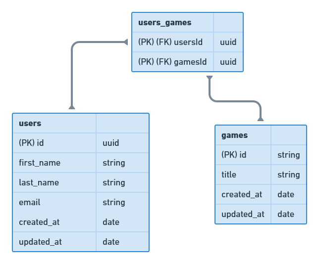

# Desafio - Modelagem do banco de dados

Desafio 02 do capítulo III da trilha NodeJS do bootcamp Ignite, da Rocketseat.

## O desafio: Modelagem do banco de dados

O objetivo desse desafio é criar a modelagem do banco de dados da aplicação do desafio anterior. 

[Instruções](https://www.notion.so/Desafio-02-Modelagem-do-banco-de-dados-0ce9c10f9e114be0a9ee9359d68639ff)

# Diagrama

